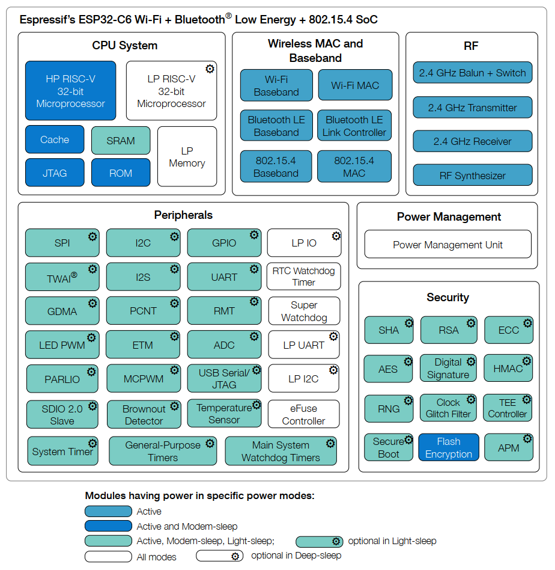

# Overview

1* risc-v@160MHz + 1* risc-v@20MHz, H-SRAM 512KB, L-SRAM 16KB, ROM 320KB, WiFi 6, BT 5.3.

# CPU

- 高性能 RISC-V 处理器：

    - 时钟频率：最高 160 MHz
    - 四级流水线架构
    - CoreMark® 得分： 496.66 CoreMark； 3.10 CoreMark/MHz (160 MHz)

- 低功耗 RISC-V 处理器：

    - 时钟频率：最高 20 MHz
    - 二级流水线架构

- L1 cache： 32 KB

- ROM： 320 KB

- HP SRAM： 512 KB

- LP SRAM： 16 KB

- 支持的 SPI 协议： SPI、 Dual SPI、 Quad SPI、 QPI接口在芯片封装外连接 flash 和其他 SPI 设备

- 通过 cache 加速 flash 访问

- 支持 flash 在线编程 (ICP)

# WiFi

- 工作在 2.4 GHz 频段， 1T1R

- 工作信道中心频率范围： 2412 ~ 2484 MHz

- 支持 IEEE 802.11ax 协议：

    - 仅 20 MHz 非接入点工作模式 (20 MHz-only non-AP mode)
    - MCS0 ~ MCS9
    - 上行、下行正交频分多址接入 (OFDMA)，特别适用于高密度应用下的多用户并发传输
    - 下行多用户多输入多输出 (MU-MIMO)，提升网络容量
    - 波束成形接收端 (Beamformee)，提升信号质量
    - 信道质量指示 (Channel quality indication, CQI)
    - 双载波调制 (dual carrier modulation, DCM)，提高链路稳定性
    - 空间复用 (Spatial reuse)，提升网络容量
    - 目标唤醒时间 (TWT)，提供更好的节能机制

- 完全兼容 IEEE 802.11b/g/n 协议：

    - 支持 20 MHz 和 40 MHz 频宽
    - 数据速率高达 150 Mbps
    - 无线多媒体 (WMM)
    - 帧聚合 (TX/RX A-MPDU, TX/RX A-MSDU)
    - 立即块确认 (Immediate Block ACK)
    - 分片和重组 (Fragmentation and defragmentation)
    - 传输机会 (Transmission opportunity, TXOP)
    - Beacon 自动监测（硬件 TSF）
    - 4 个虚拟 Wi-Fi 接口
    - 同时支持基础结构型网络 (Infrastructure BSS) Station 模式、 SoftAP 模式、 Station + SoftAP 模式和混杂模式请注意 ESP32-C6 在 Station 模式下扫描时，SoftAP 信道会同时改变
    - 天线分集
    - 802.11 mc FTM

# Bluetooth

- 低功耗蓝牙 (Bluetooth LE)：通过 Bluetooth 5.3认证

- Bluetooth mesh

- 高功率模式 (20 dBm)

- 速率支持 125 Kbps、 500 Kbps、 1 Mbps、 2 Mbps

- 广播扩展 (Advertising Extensions)

- 多广播 (Multiple Advertisement Sets)

- 信道选择 (Channel Selection Algorithm #2)

- 功率控制 (LE Power Control)

- Wi-Fi 与蓝牙共存，共用同一个天线

# IEEE 802.15.4

- 兼容 IEEE 802.15.4-2015 协议

- 工作在 2.4 GHz 频段，支持 OQPSK PHY

- 数据速率： 250 Kbps

- 支持 Thread 1.3

- 支持 Zigbee 3.0

# Peripheral

- 30 个 GPIO 口 (QFN40) 或 22 个 GPIO 口 (QFN32)

    - 5 个作为 strapping 管脚
    - 6 个用于连接 封装外 flash

- 模拟接口：

    - 12 位 SAR ADC，多达 7 个通道
    - 温度传感器

- 数字接口：

    - 2 个 UART
    - 低功耗 UART (LP UART)
    - 2 个 SPI 接口用于连接 flash
    - 通用 SPI 接口
    - I2C
    - 低功耗 I2C (LP I2C)
    - I2S
    - 脉冲计数控制器
    - USB 串口/JTAG 控制器
    - 2 个 TWAI® 控制器，兼容 ISO11898-1（CAN规范 2.0）
    - SDIO2.0 从机控制器
    - LED PWM 控制器，多达 6 个通道
    - 电机控制脉宽调制器 (MCPWM)
    - 红外遥控器 (TX/RX)
    - 并行 IO 接口 (PARLIO)
    - 通用 DMA 控制器（简称 GDMA）， 3 个接收通道和 3 个发送通道
    - 事件任务矩阵 (ETM)

- 定时器：

    - 52 位系统定时器
    - 2 个 54 位通用定时器
    - 3 个数字看门狗定时器
    - 模拟看门狗定时器

# Power Management

- 通过选择时钟频率、占空比、 Wi-Fi 工作模式和单独控制内部器件的电源，实现精准电源控制

- 针对典型场景设计的四种功耗模式： Active、Modem-sleep、 Light-sleep、 Deep-sleep

- Deep-sleep 模式下功耗低至 7 µA

- Deep-sleep 模式下低功耗存储器 (LP memory) 仍保持工作

# Security

- 安全启动 - 内部和外部存储器的权限控制

- Flash 加密 - 加密和解密存储器

- 4096 位 OTP，用户可用的高达 1792 位

- 可信执行环境控制器 (TEE) 和访问（地址）权限管理 (APM)

- 加密硬件加速器：

    - AES-128/256 (FIPS PUB 197)
    - ECC
    - HMAC
    - RSA
    - SHA (FIPS PUB 180-4)
    - 数字签名

- 片外存储器加密与解密 (XTS_AES)

- 随机数生成器 (RNG)

# RF

- 天线开关、射频巴伦 (balun)、功率放大器、低噪声放大器

- 802.11b 传输功率高达 +21 dBm

- 802.11ax 传输功率高达 +19.5 dBm

- 低功耗蓝牙接收器灵敏度 (125 Kbps) 高达 -106dBm
