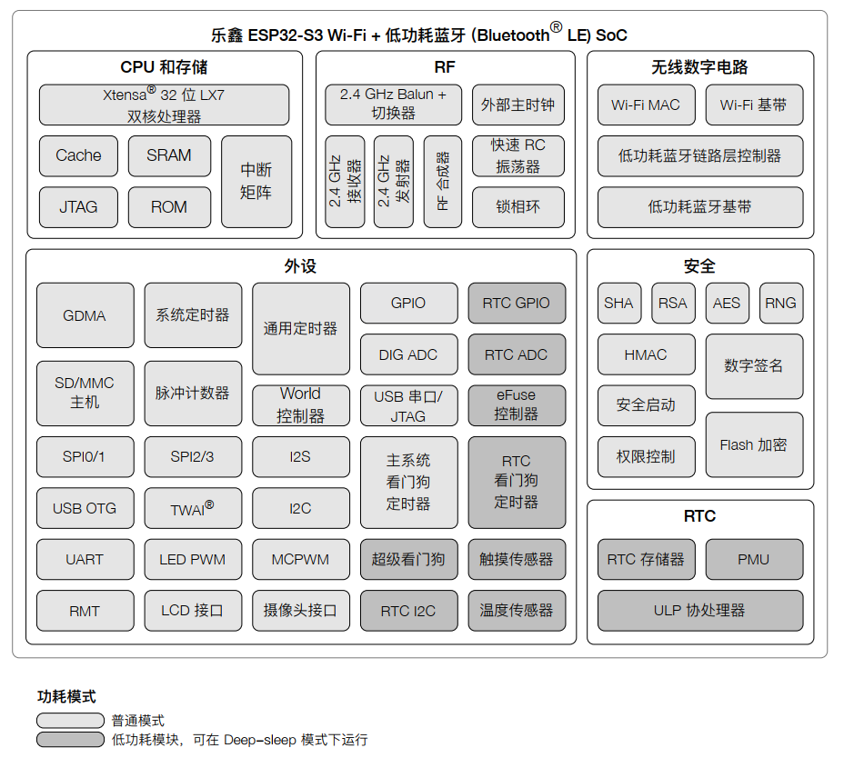

# Overview

2* Xtensa LX7@240MHz, SRAM 512KB, ROM 384KB, WiFi 4, BT 5.0.

# CPU

- Xtensa® 32 位 LX7 双核处理器

- 时钟频率：最高 240 MHz

- CoreMark® 得分：

    - 单核，主频 240 MHz： 613.86 CoreMark； 2.56 CoreMark/MHz
    - 双核，主频 240 MHz： 1181.60 CoreMark； 4.92 CoreMark/MHz

- 五级流水线架构

- 128 位数据总线位宽，专用的 SIMD 指令

- 单精度浮点运算单元 (FPU)

- L1 cache

- ROM： 384 KB

- SRAM： 512 KB

- RTC SRAM： 16 KB

- 支持 SPI 协议： SPI、 Dual SPI、 Quad SPI、 Octal SPI、 QPI、 OPI，可外接 flash、片外 RAM 和其他 SPI 设备

- 引入 cache 机制的 flash 控制器

- 支持 flash 在线编程

# WiFi

- 支持 IEEE 802.11b/g/n 协议

- 在 2.4 GHz 频带支持 20 MHz 和 40 MHz 频宽

- 支持 1T1R 模式，数据速率高达 150 Mbps

- 无线多媒体 (WMM)

- 帧聚合 (TX/RX A-MPDU, TX/RX A-MSDU)

- 立即块确认 (Immediate Block ACK)

- 分片和重组 (Fragmentation/defragmentation)

- Beacon 自动监测（硬件 TSF）

- 4 个虚拟 Wi-Fi 接口

- 同时支持基础结构型网络 (Infrastructure BSS) Station 模式、 SoftAP 模式和 Station + SoftAP 模式, 请注意， ESP32-S3 在 Station 模式下扫描时， SoftAP 信道会同时改变

- 天线分集

- 802.11 mc FTM

# Bluetooth

- 低功耗蓝牙 (Bluetooth LE)： Bluetooth 5、 Bluetooth mesh

- 高功率模式 (20 dBm)

- 速率支持 125 Kbps、 500 Kbps、 1 Mbps、 2 Mbps

- 广播扩展 (Advertising Extensions)

- 多广播 (Multiple Advertisement Sets)

- 信道选择 (Channel Selection Algorithm #2)

- Wi-Fi 与蓝牙共存，共用同一个天线

# Peripheral

- 45 个可编程 GPIO

    - 4 个作为 strapping 管脚
    - 6 个或 7 个用于连接封装内 flash 或 PSRAM：

        - ESP32-S3FN8、 ESP32-S3R2、 ESP32-S3R8、 ESP32-S3R8V、 ESP32-S3R16V： 6 个用于连接
        - ESP32-S3FH4R2： 7 个用于连接

- 数字接口：

    - 2 个 SPI 接口用于连接 flash 和 RAM
    - 2 个通用 SPI 接口
    - LCD 接口（8 位 + 16 位并行 RGB、 I8080、 MOTO6800） , 支持 RGB565、 YUV422、 YUV420、 YUV411之间互相转换
    - DVP 8 位 + 16 位摄像头接口
    - 3 个 UART 接口
    - 2 个 I2C 接口
    - 2 个 I2S 接口
    - RMT (TX/RX)
    - 脉冲计数器
    - LED PWM 控制器，多达 8 个通道
    - 全速 USB OTG
    - USB 串口/JTAG 控制器
    - 2 个电机控制脉宽调制器 (MCPWM)
    - SD/MMC 主机接口，具有 2 个卡槽
    - 通用 DMA 控制器 (简称 GDMA)， 5 个接收通道和 5 个发送通道
    - TWAI® 控制器，兼容 ISO 11898-1（CAN 规范 2.0）
    - 片上 JTAG 调试功能

- 模拟接口：

    - 2 个 12 位 SAR ADC，多达 20 个通道
    - 温度传感器
    - 14 个电容式传感 GPIO

- 定时器：

    - 4 个 54 位通用定时器
    - 52 位系统定时器
    - 3 个看门狗定时器

# Power Management

- 通过选择时钟频率、占空比、 Wi-Fi 工作模式和单独控制内部器件的电源，实现精准电源控制

- 针对典型场景设计的四种功耗模式： Active、 Modem-sleep、 Light-sleep、 Deep-sleep

- Deep-sleep 模式下功耗低至 7 µA

- 超低功耗协处理器 (ULP)：

    - ULP-RISC-V 协处理器
    - ULP-FSM 协处理器

- Deep-sleep 模式下 RTC 存储器仍保持工作

# Security

- 安全启动

- Flash 加密

- 4-Kbit OTP，用户可用的高达 1792 位

- 加密硬件加速器：

    - AES-128/256 (FIPS PUB 197)
    - SHA (FIPS PUB 180-4)
    - RSA
    - 随机数生成器 (RNG)
    - HMAC
    - 数字签名
