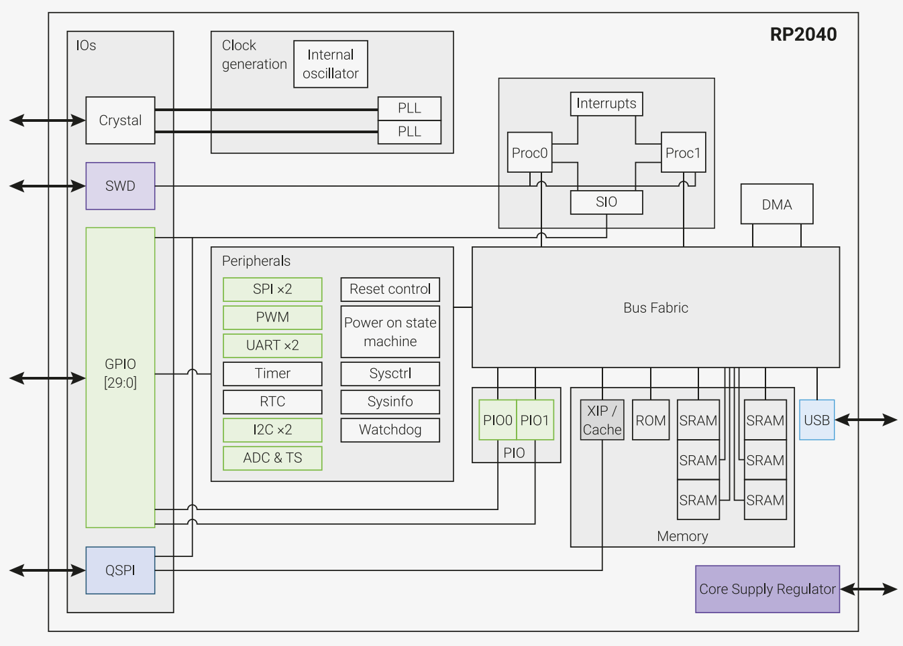

# Overview

2* ARM Cortex-M0+ @133Mhz, SRAM 264KB, ROM 16KB.

# CPU

- 双核 ARM Cortex-M0+ @ 133MHz

- 264kB 片上 SRAM 在6个独立 banks

- 通过专用QSPI总线支持高达16MB的片外闪存

- DMA 控制器

- 全连接 AHB crossbar

- Interpolator和integer divider外设

- 片上可编程 LDO 生成 core 电压

- 2片上锁相环生成USB和核心时钟

# Peripherals

- 2 UARTs

- 2 SPI 控制器

- 2 I2C 控制器

- 16 PWM 通道

- USB 1.1控制器和PHY，具有主机和设备支持

- 8 PIO 状态机
