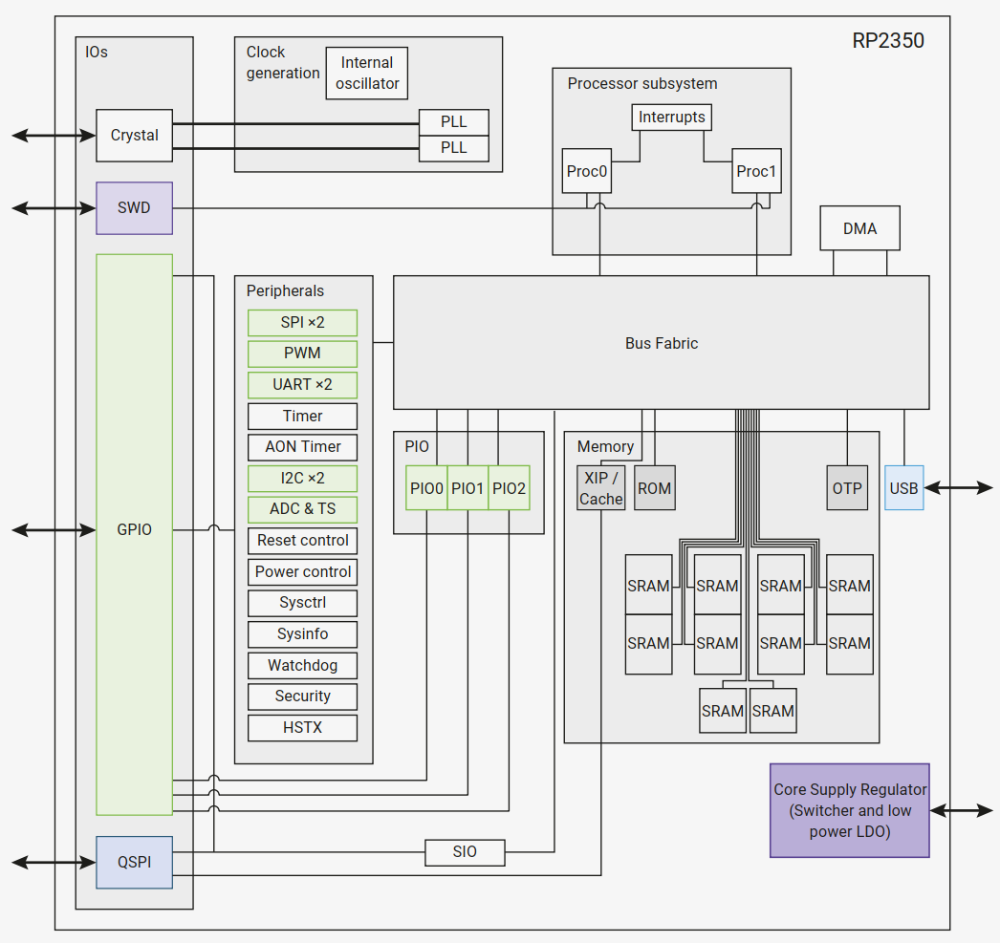

# Overview

(2* ARM Cortex-M33 + 2* RISC-V Hazard3)@150MHz, SRAM 520KB, ROM 32KB.

# CPU

- 双Cortex-M33或Hazard3处理器，频率为150MHz

- 520 KB 片上 SRAM, 分布在 10 独立 bank

- 8KB的一次性可编程存储 (OTP)

- 高达16 MB的外部QSPI flash/PSRAM通过专用的QSPI总线

- 2×片上锁相环，用于内部或外部时钟生成

    - 额外的16 MB flash/PSRAM可通过可选的第二芯片选择

- 产生Core电压的片上开关模式电源

    - 睡眠状态下可以启用低静电流LDO模式

# Peripherals

- 2× UARTs

- 2× SPI 控制器

- 2× I2C 控制器

- 24× PWM 通道

- USB 1.1控制器和PHY，支持主机和设备模式

- 12× PIO 状态机

- 1× HSTX 外设

# Security

- 可选的引导签名，由片上掩码ROM强制执行，在OTP中使用密钥指纹

- 可选引导解密密钥的受保护OTP存储

- 基于Arm或RISC-V安全/特权级别的全局总线过滤

- 外设、GPIOs和DMA通道可单独分配给安全域

- 针对故障注入攻击的硬件防护措施

- 硬件SHA-256加速器
